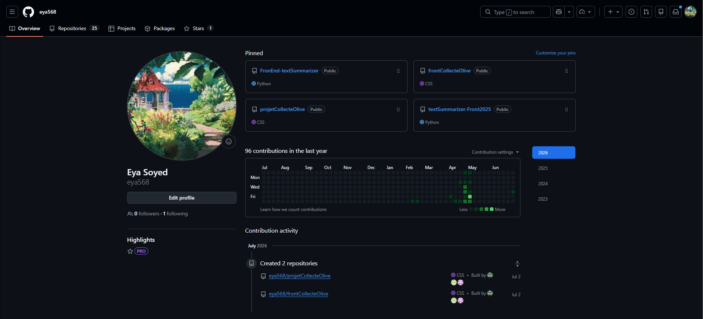

# Introduction au DevOps & Fondations Applicatives

## Objectif du document
Ce guide contient les axes de recherche et les questions clés auxquelles vous devez répondre pour valider les deux premières étapes de votre workshop. Vous pouvez utilisez l'IA (ChatGPT, Claude, etc.) ou des ressources vidéo pour mener vos recherches, puis consignez vos réponses dans le rapport selon la structure demandée à la fin.

---

## PHASE 0 : Initialisation & Création des Environnements

### 1. Immersion Culturelle : Qu'est-ce que le DevOps ?

**Q1.1** : Expliquez avec vos propres mots ce qu'est le mouvement DevOps. Quelle est la différence majeure entre l'organisation d'une équipe technique avant le DevOps (le modèle traditionnel "Silos") et après l'adoption du DevOps ?

DevOps est une approche qui rapproche les équipes de développement (Dev) et d'exploitation (Ops) afin qu'elles collaborent tout au long du cycle de vie d'une application.
- Avant (modèle en silos) : les développeurs créaient l'application puis la transmettaient aux équipes d'exploitation, avec peu de communication, ce qui entraînait souvent des retards et des problèmes lors du déploiement. 
- Après (DevOps) : les équipes travaillent ensemble dès le début, automatisent les tests et les déploiements, ce qui permet de livrer plus rapidement et avec moins d'erreurs. 

**Q1.2** : Quel est le but ultime du DevOps lorsqu'on développe et qu'on livre un logiciel à des utilisateurs ?**

Le but du DevOps est de livrer des logiciels fiables plus rapidement tout en garantissant la qualité et la stabilité de l'application.
---

### 2. Configuration des Comptes (Livrable Obligatoire)

Vous devez créer un compte sur les trois plateformes industrielles suivantes. **Exigence** : Remplissez le tableau suivant dans votre rapport avec vos identifiants exacts :

| Plateforme | Utilité dans le Workshop | Nom d'utilisateur (Username) | URL du Profil |
| :--- | :--- | :--- | :--- |
| **GitHub** | Hébergement du code & Automatisation CI/CD | `eya568` | `https://github.com/eya568` |
| **DockerHub** | Registre public pour nos conteneurs | `eyasoyed` | `https://app.docker.com/accounts/eyasoyed` |
| **Microsoft Azure** | Infrastructure Cloud de Production | `swayedaya@gmail.com` | Eya Soyed |

---
  

## PHASE 1 : Fondations du Web Development & Gestion des Sources

### Module A : Architecture Web & Communication (The "Why")

**Q2.1** : Quelle est la différence fondamentale entre le Frontend et le Backend d'une application ? Quel est le rôle spécifique de la Base de données ?

-Le *Frontend* correspond à la partie visible et interactive d’une application, exécutée dans le navigateur. Il gère UI/UX.

-Le *Backend* est la partie côté serveur. Il contient la logique métier, traite les demandes du frontend, applique les règles de l’application et gère les opérations (authentification, calculs, traitement des données).

-La *Base de données* sert à stocker et organiser les données de manière persistante. Elle permet au backend de sauvegarder, récupérer et modifier les informations (utilisateurs, produits, transactions, etc.) de façon structurée et sécurisée.

**Q2.2** : Comparez brièvement l'Architecture Client-Serveur et l'Architecture 3-Tiers (3 couches). Pourquoi l'architecture 3-tiers est-elle considérée comme standard et plus sécurisée pour le web ?

2-Tier (Client-Serveur): on sépare le Client (interface) du Serveur (qui gère logique métier + données en même temps). Plusieurs clients peuvent maintenant se connecter, mais le serveur fait trop de choses à la fois — difficile à sécuriser et à maintenir.

3-Tier : on sépare en 3 couches indépendantes :
- Frontend (interface)
- Backend (logique métier)
- Base de données** (stockage)

-->standard
- La base de données n'est jamais exposée directement → moins de surface d'attaque
- Chaque couche a un rôle unique → code plus facile à maintenir
- On peut faire évoluer une couche sans casser les autres (ex : changer de base de données sans toucher au Frontend)

**Q2.3** : Qu'est-ce qu'une API (Application Programming Interface) ? Prenez l'analogie d'un serveur dans un restaurant pour expliquer son rôle entre le Frontend et le Backend.

Une **API** est un ensemble de règles qui permet à deux logiciels de communiquer entre eux, sans que l'un ait besoin de connaître le fonctionnement interne de l'autre. Elle définit quelles requêtes on peut envoyer, et quelles réponses on peut recevoir.

L'analogie du restaurant

- **Le client (Frontend)** = la personne assise à table qui a faim
- **La cuisine (Backend)** = là où la nourriture est réellement préparée
- **Le serveur du restaurant (API)** = l'intermédiaire entre les deux

Le client ne va jamais directement en cuisine pour préparer son plat lui-même — il donne sa commande au serveur, qui la transmet à la cuisine dans un format que la cuisine comprend. Une fois le plat prêt, le serveur le ramène au client.

Le client n'a pas besoin de savoir **comment** le plat est cuisiné  — il communique juste via un menu standard (le contrat de l'API), et reçoit un résultat.
*Concrètement en informatique :
- Le Frontend envoie une requête à l'API (ex : "donne-moi la liste des produits")
- L'API transmet cette demande au Backend, qui va chercher l'info (souvent en interrogeant la base de données)
- L'API renvoie la réponse au Frontend dans un format standard (souvent **JSON**)

En résumé : l'API est le **messager standardisé** qui permet au Frontend de demander des choses au Backend sans jamais avoir besoin de connaître les détails internes de son fonctionnement.

**Q2.4 : Comment sécurise-t-on la communication entre le Backend et la Base de données pour éviter que n'importe qui puisse lire ou modifier nos données ?**

Le frontend n'accède jamais directement à la base de données.
Les identifiants sont protégés dans le fichier .env.
Les connexions peuvent être chiffrées (TLS/SSL).
Le backend contrôle les autorisations avant toute opération sur les données.
---

### Module B : Configuration, Frameworks & Écosystème

**Q3.1** : Que sont les variables d'environnement (`.env`) ? Pourquoi est-il strictement interdit d'écrire des mots de passe ou des clés d'API directement dans le code source (Hardcoding) ?

Les variables d’environnement (souvent stockées dans un fichier .env) sont des paramètres de configuration externes à l’application, comme les mots de passe, clés API ou URLs de base de données. Elles permettent de séparer le code du contexte d’exécution.

Le fait de ne pas écrire ces informations directement dans le code (hardcoding) est essentiel pour la sécurité et la maintenance : si le code est partagé ou publié (par exemple sur GitHub), ces données sensibles ne sont pas exposées. Cela permet aussi de changer facilement de configuration entre différents environnements (développement, test, production) sans modifier le code.

**Q3.2** : Comment configure-t-on le fichier `.gitignore` pour s'assurer que le fichier `.env` local ne soit jamais publié sur GitHub ?

Pour protéger un fichier .env, on ajoute cette ligne dans .gitignore *.env*

**Q3.3**: Dans l'écosystème du développement moderne, expliquez brièvement la différence entre : Un Framework, une Dépendance (ou Package) et une Librairie Open Source.

*Framework* : C'est une base de développement qui fournit une architecture et un ensemble d'outils pour construire une application. Il impose une certaine façon d'organiser le projet et de développer les fonctionnalités.

*Dépendance (Package)* : C'est un composant externe que l'on ajoute au projet pour répondre à un besoin précis, sans avoir à le développer soi-même. Il est géré par un gestionnaire de paquets (npm, pip, Maven, etc.).

*Librairie Open Source* : C'est du code mis à disposition de la communauté, que chacun peut utiliser, étudier et parfois modifier. Une librairie peut être utilisée directement dans un projet ou être distribuée sous forme de package.
---

### Module C : Anatomie d'un Projet & Risques (Dev VS Prod)

**Q4.1** : Observez l'arborescence standard d'un projet web moderne (exemple type d'un projet full-stack). Expliquez brièvement le rôle des dossiers clés :

my-app/
├── frontend/         # Code exécuté dans le navigateur de l'utilisateur
│   ├── src/          # Contient le code source du frontend (composants, pages, styles, logique de l'interface) 
│   └── package.json  # Gestion des dépendances du Frontend
├── backend/          # Code exécuté sur le serveur (Logique métier)
│   ├── src/
│   ├── .env          # Variables de configuration confidentielles
│   └── package.json  # Gestion des dépendances du Backend
└── .gitignore        # Liste des fichiers à exclure du tracking Git

**Q4.2** : Qu'est-ce qui différencie un Environnement de Développement Local (votre PC) d'un Environnement de Production (le Cloud en ligne) ?

le local sert à développer et tester, tandis que la production sert à exécuter l'application pour les utilisateurs dans des conditions réelles.

**Q4.3** : Citez 2 risques ou bugs majeurs qui peuvent survenir lorsqu'on passe une application du local à la production (le fameux "Mais ça marchait sur ma machine !"). Comment le DevOps aide-t-il à prévenir ces risques ?

- Différences d'environnement
- Volume de données et de trafic — En local tu testes avec une petite base de données et un seul utilisateur

### Module D : Maîtrise de Git & Préparation à l'Automatisation**

**Q5.1** : Quelle est la différence essentielle entre Git et GitHub ?

* Git est un outil de gestion de versions installé sur votre ordinateur.
* GitHub est une plateforme en ligne qui héberge les dépôts Git

**Q5.2** : Qu'est-ce que le contrôle de version et pourquoi est-ce indispensable quand plusieurs ingénieurs travaillent sur le même projet ?

Le contrôle de version est un système qui enregistre l’historique des modifications apportées au code d’un projet.
Il est indispensable en équipe car plusieurs ingénieurs peuvent travailler simultanément sur les mêmes fichiers sans écraser le travail des autres. Il facilite la collaboration, la gestion des conflits de code et assure une meilleure organisation du projet, tout en réduisant les risques d’erreurs irréversibles.

**Q5.3** : Expliquez le cycle de vie d'une modification de code à travers ces actions fondamentales : Commit → Push → Pull.

* Commit : c’est l’action locale qui enregistre un ensemble de modifications dans l’historique Git du projet. Chaque  commit représente une version stable ou cohérente du code avec un message descriptif.
* Push : c’est l’action qui envoie les commits locaux vers un dépôt distant (comme GitHub). Cela permet de partager les modifications avec le reste de l’équipe.
* Pull : c’est l’action inverse du push. Elle permet de récupérer les dernières modifications depuis le dépôt distant vers sa machine locale afin de rester synchronisé avec le projet.

**Q5.4** : Comment fonctionnent les Branches dans Git ? Comment deux développeurs peuvent-ils coder en même temps sans écraser le travail de l'autre ?

Deux développeurs peuvent travailler en parallèle en créant chacun leur propre branche. Ils développent leurs fonctionnalités séparément, puis fusionnent leurs changements dans la branche principale via un merge (ou une pull request sur GitHub).

**Q5.5** : Quelle est la différence entre un dépôt Public et Privé ? Dans quel cas choisit-on l'un ou l'autre ?

* Public → partage, open source, visibilité
* Privé → sécurité, contrôle, usage interne ou confidentiel

**Q5.6**: En grattant la surface : Qu'est-ce qu'un pipeline CI/CD et quel est le rôle de GitHub Actions dans ce processus d'automatisation ?

* CI (Intégration Continue) : à chaque push, le code est automatiquement testé (tests unitaires, vérification que ça compile, linting) pour détecter les erreurs le plus tôt possible, avant qu'elles n'atteignent la branche principale.
* CD (Déploiement Continu) : si les tests passent, le code est automatiquement déployé (vers un serveur de staging ou même directement en production).
* GitHub Actions est l'outil qui exécute ce pipeline directement dans GitHub. On définit des workflows (dans des fichiers YAML) qui automatisent des tâches comme les tests, le build et le déploiement à chaque push ou pull request.

###  Structure de rapport demandée 

Tous les membres doivent rendre leur rapport au format Markdown (.md) nommé Rapport_Phase_0_1.md dans leur dépôt GitHub. Le document doit respecter scrupuleusement la structure suivante :
markdown

# Rapport d'Ingénierie : Initialisation & Fondations Web
**Titre de la phase :** Phase 0 & 1 - Initialisation & Fondations Web
**Préparé par :** `Eya Soyed`
---

## 1. Comptes & Environnements (Phase 0)
* Inclure ici le tableau complété des plateformes (GitHub, DockerHub, Azure).
* Capture d'écran montrant vos profil GitHub actif.

## 2. Rapport de Concepts Théoriques (The "Why")
* Répondez ici à toutes les questions des Modules A, B, C et D de manière claire, concise et vulgarisée. 

## 3. Journal d'Implémentation Technique (The "How")
Racontez votre expérience pratique sur cette phase :
* Comment avez-vous initialisé votre premier dépôt Git ? (Fournir les commandes utilisées).
* Comment avez-vous testé l'isolation de votre fichier `.env` ?

git init
git add .
git commit -m "Initial commit"
git remote add origin https://github.com/eya568/sourceToCloud
git push -u origin main

Pour tester l'isolation de mon fichier .env, je l'ai ajouté dans mon fichier .gitignore, puis j'ai lancé "git status" pour vérifier qu'il n'apparaissait pas dans la liste des fichiers trackés. J'ai aussi vérifié directement sur GitHub après un push que le fichier .env n'était pas visible dans le dépôt

## 4. Tableau Post-Mortem (Gestion des Erreurs)
Si vous avez rencontré des erreurs ou des blocages durant vos manipulations (Git, commandes, configuration), vous devez obligatoirement remplir ce tableau (Même si l'erreur a été résolue par l'IA) :

| Erreur / Message de Log | Cause de l'erreur | Comment l'avez-vous résolue ? |
| :--- | :--- | :--- |
| *Ex: fatal: pathspec '.env' did not match...* | *Le fichier n'était pas dans le bon dossier* | *Déplacement du fichier et réexécution de git add* |

## 5. Conclusion & Prochaine Étape
* Qu'avez-vous appris de plus important durant cette phase ?
* Vous sentez-vous prêt à passer à l'étape "Infrastructure & Linux" ?

Cette phase m'a permis de mieux comprendre comment le DevOps rapproche développement et exploitation, et pourquoi la séparation en couches (3-tier) et la sécurisation des données (variables d'environnement, .gitignore) sont essentielles dès le début d'un projet. 